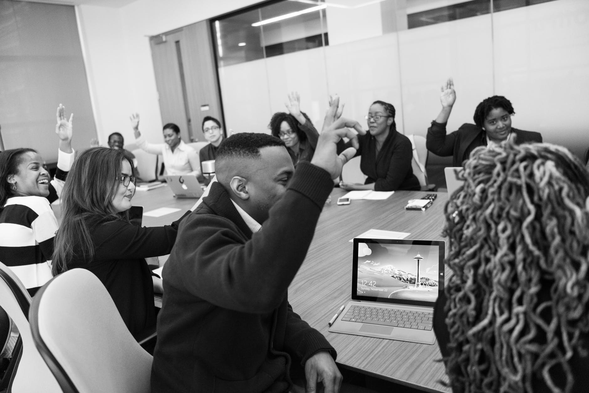

Lately I’ve been hearing much more of the word culture when it comes to defining our workspaces. As we grow deeper in consciousness and inclusivity, culture no longer refers to the free Starbursts in the office kitchen or the Friday afternoon happy hour. Of course some aspects of culture are tangible, but that’s just the tip of the proverbial Starburst iceberg. So what is culture, exactly?

To me, culture is the product of everything tangible and intangible. It’s the energy of the room, the ways we make decisions, how we hire, where attention is given. It’s hard to catch between your fingers because it’s always moving and nearly always invisible. For many of us, culture is the water we’re swimming in 8-10 hours of the day while we sift through emails, converse with coworkers, walk through spaces designed to keep our bodies and minds at work. Like a fish, we don’t consciously notice the water around us, but it’s everywhere.

Just think – in biological terms, culture is what maintains the conditions suitable for growth. It’s a noun and a verb, a collective and an action. No wonder it’s easy to get intimidated about creating it, living it, and sustaining it.

As we think about how to create a stronger and more inclusive culture, perhaps it’s helpful to think of it like building any other skill. Like strengthening a muscle. Maybe you can get good at being a cultural leader just like you can get good at public speaking, or coding, or knitting. Maybe it takes some practice, iterations, and a whole lot of mistake-making to get you there.

Building an inclusive culture creates a foundation for diversity, equity, and inclusion work to flourish (and vice versa). It starts with small investments every day that over time builds to big changes. Think of it like an investment, where the payoffs build as time goes on – when we create more equitable hiring practices, we lessen interruptions during team meetings, we name unchecked biases, we establish a parental leave policy. We build space for people to bring their open and authentic selves to work, to take risks, to make necessary mistakes for growth. We grant the grand-supreme gift of psychological safety in the workplace.

Culture work is cool, because rather than being a distraction from progress, it actually insulates us against losing progress. People will perform well when they trust one another, when they perceive they’re treated fairly, when they feel valued as a person. One of the hallmarks of great companies is a palpable sense of respect, and one where people can jive with the mission of the bigger picture. The all in this together mentality fortifies the house we live in. 

>**People will perform well when they trust one another, when they perceive they’re treated fairly, when they feel valued as a person.**

As a hiring manager, I think a lot about the candidates I hire, but I also think about the 50+ candidates I turned away for the same job. For those who are interviewed and turned away, we need to think about making a good hiring process regardless of outcome. We can adopt the lens of the ripple effect. Everyone you interview can become an advocate for you, for your company. Maybe they’ll recommend your organization to others, spread a good word, or come back to support you in another way through volunteering or reviews. Recruiting and retaining people doesn’t happen because of your product or your service alone (by far). People stick around because they feel connected to the culture. The right team in the right environment can outpace any project that will come and go across my desk.

So how do we develop our culture? A good place to start is to start to taste the little slices of humble pie and come to terms with the fact that we’re far from perfect. Mistakes happen. We largely underestimate our ability to be changemakers (“DEI isn’t my thing”) and think we’re not good enough. Perhaps we can lower the stakes and get over our discomfort with mistakes. We can be authentic open, and collaborative, seeing culture as muscle that can be developed with practice and incremental steps. We can stop taking ourselves so seriously.

To build an inclusive culture, we need to start conversation. No one needs to be “in charge”, and no one is certainly writing a prescription for how to freshen the water we’re swimming in. When mistakes happen we talk, we reflect, we problem solve. We amplify credit where it’s due. We create clear expectations. We invest in and value emotional intelligence as a way to keep our practices in check, to keep challenging ourselves in productive ways. 

As we’re thinking more about organizational culture, let’s share what we learn. Big movements start with small ideas that grow in size and force – the more we invite others into the conversation, the more we learn collectively. That elusive culture, that state of feeling valued, understood, and empowered – that feels worth it.
